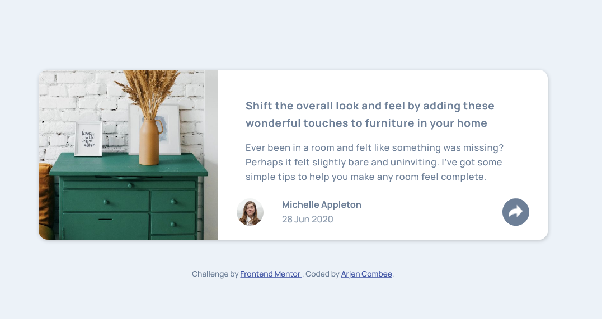
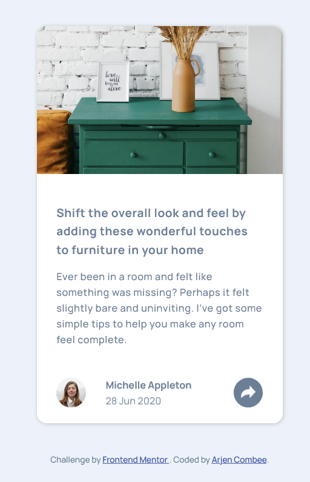

# Frontend Mentor - Article preview component solution

This is a solution to the [Article preview component challenge on Frontend Mentor](https://www.frontendmentor.io/challenges/article-preview-component-dYBN_pYFT). Frontend Mentor challenges help you improve your coding skills by building realistic projects.

## Table of contents

- [Frontend Mentor - Article preview component solution](#frontend-mentor---article-preview-component-solution)
  - [Table of contents](#table-of-contents)
  - [Overview](#overview)
    - [The challenge](#the-challenge)
    - [Screenshot](#screenshot)
    - [Links](#links)
  - [My process](#my-process)
    - [Built with](#built-with)
    - [What I learned](#what-i-learned)
    - [Continued development](#continued-development)
    - [Useful resources](#useful-resources)
  - [Author](#author)
  - [Acknowledgments](#acknowledgments)

**Note: Delete this note and update the table of contents based on what sections you keep.**

## Overview

### The challenge

Users should be able to:

- View the optimal layout for the component depending on their device's screen size
- See the social media share links when they click the share icon

### Screenshot

Destop version


Mobile version


### Links

- Solution URL: [Add solution URL here](https://your-solution-url.com)
- Live Site URL: [Githubpage](https://arjencombee.github.io/003_article_preview/)

## My process

### Built with

- Semantic HTML5 markup
- CSS custom properties
- Flexbox
- CSS Grid
- Mobile-first workflow
- JavaScript

### What I learned

Before coding you must layout how all pieces should interact and what can be nested and reused.

To see how you can add code snippets, see below:

```css
.arrow-down {
  position: absolute;
  bottom: -0.95rem;
  left: 50%;
  width: 0;
  height: 0;
  border-left: 1rem solid transparent;
  border-right: 1rem solid transparent;
  border-top: 1rem solid var(--DarkGrayishBlue);
}
```

The CSS code above creates the down-arrow which is used in destop-active state.

### Continued development

In previous projecs I struggled alot with the images. And in this project it was 'easier', but still needed some rework to get things 'right'.

### Useful resources

- [CSS Tricks](https://css-tricks.com/snippets/css/css-triangle) - This helped me in creating the down-arrow. I was almost there my self, but after a couple of hours I googled 🤔

## Author

- Website - [Arjen Combee](https://arjencombee.nl)
- Frontend Mentor - [@ArjenCombee](https://www.frontendmentor.io/profile/arjencombee)

## Acknowledgments

I want to say a big thank you to people who are responible for my **junior junior skills** in webdevelopment:

- Brad Traversy - [Traversy Media](https://www.traversymedia.com/)
- Jonas Schmedtmann - [Codingheroes](https://codingheroes.io/)
- Kevin Powell - [Kevin Powell on youtube ](https://www.youtube.com/kevinpowell)

♥ Thanks
